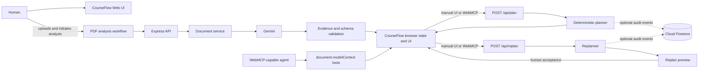

# CourseFlow WebMCP

CourseFlow converts assignment briefs into grounded, workload-aware execution plans. Its WebMCP extension lets browser agents participate in the real planning workflow through structured site tools, while keeping the student in control of the schedule.

## Why WebMCP

Without structured site tools, an agent must infer page controls and manipulate the UI indirectly. CourseFlow exposes meaningful planning operations instead: read the current coursework analysis, set a student's availability, create a plan, and propose a replan.

This makes the human-agent handoff explicit. The human uploads and analyzes the coursework; the agent can operate the planning workflow against the same visible state. Replanning is deliberately human-in-the-loop: an agent creates a preview, and the human explicitly accepts it before the active schedule changes.

## Human + agent workflow

1. The human uploads and analyzes an assignment PDF.
2. An agent calls `get_coursework_analysis` to inspect the extracted coursework.
3. The agent calls `set_availability` with the student's work windows.
4. The agent calls `create_execution_plan`.
5. The agent reads the returned feasibility information.
6. If the plan needs repair, the agent calls `replan_coursework` with replacement availability.
7. CourseFlow shows the normal Step 4 replan preview.
8. The human reviews the changes and clicks **Accept & View Updated Schedule** to make that preview active.

## WebMCP tools

| Tool | Nature | Purpose | Prerequisite | Important behavior |
| --- | --- | --- | --- | --- |
| `get_coursework_analysis` | Read | Reads the coursework analysis currently loaded in CourseFlow. | Human has analyzed coursework. | Returns `not_ready` until analysis exists; it exposes a concise analysis, not browser state or files. |
| `set_availability` | Write | Replaces the student's visible availability with structured ISO date-time windows. | At least one valid window. | Validates all windows before changing state; invalid input leaves the current availability and plan intact. |
| `create_execution_plan` | Write | Builds the real CourseFlow execution plan. | Coursework analysis and valid availability. | Calls the existing planner path and updates the normal Plan UI. |
| `replan_coursework` | Write, preview | Proposes replacement availability and repairs an accepted plan around it. | Coursework analysis and an accepted plan. | Calls the existing replanner and shows a preview only; a human must accept it before availability or the active plan changes. |

## WebMCP implementation

The active top-level browser application registers site tools with the imperative `document.modelContext.registerTool(...)` API. Registration is feature-detected, so browsers without WebMCP continue to use CourseFlow normally. This follows the site-tools model described in the [OpenAI WebMCP documentation](https://learn.chatgpt.com/docs/webmcp).

Tools reuse the same browser state, rendering, validation, and backend routes as the manual UI. Planning and replanning remain deterministic server-side logic; no WebMCP tool duplicates planner or replanner business logic. Agent availability is validated before any state mutation.

The shared planning endpoints are:

- `POST /api/plan`
- `POST /api/replan`

PDF analysis is initiated by the human UI. WebMCP does not call Gemini analysis directly.

## What was added for the WebMCP Challenge

CourseFlow existed before this challenge. The WebMCP-specific extension began at:

`a9e66e5` — `chore: establish WebMCP hackathon baseline`

The challenge work added after that baseline is:

- WebMCP site-tool registration and feature detection: `ac37a3e` — `feat: expose coursework analysis via WebMCP`
- Structured availability mutation and agent-triggered planning: `f93daa9` — `feat: let WebMCP agents set availability and create plans`
- Human-reviewed agent replanning: `6b3194f` — `feat: add human-reviewed WebMCP replanning`
- Atomic validation and state protection for agent-supplied availability.
- Synchronization of agent actions with the visible CourseFlow UI.

Judging should evaluate this WebMCP extension as the new challenge work, rather than treating the pre-existing CourseFlow product as newly created for the challenge.

## Architecture



## Tech stack

- JavaScript browser frontend
- TypeScript, Node.js, and Express
- WebMCP imperative site-tool API
- Google GenAI SDK and Gemini
- `pdf-parse`
- Optional Cloud Firestore event persistence
- Render deployment configuration pending; add the production URL when it is available

## Local setup

Install the locked dependencies and start the active server:

```bash
npm ci
npm run dev
```

The server listens on port `3000` by default. Set one Gemini API key before using assignment analysis:

```bash
GOOGLE_API_KEY=your_key_here
# or
GEMINI_API_KEY=your_key_here
```

Do not commit a real key. Optional Firestore audit persistence is enabled only when `GOOGLE_APPLICATION_CREDENTIALS` points to available Google application credentials. Without it, planning and replanning continue to work and persistence is skipped.

## WebMCP testing

Use a WebMCP-capable environment, such as the ChatGPT in-app browser when it is available, or Chrome 149+ with `chrome://flags/#enable-webmcp-testing` enabled.

For Chrome:

1. Open `chrome://flags/#enable-webmcp-testing`, enable the flag, and relaunch Chrome.
2. Open the CourseFlow app.
3. Upload and analyze an assignment PDF.
4. Inspect the registered tools, for example with `document.modelContext.getTools()` in the testing environment.

The expected tools are `get_coursework_analysis`, `set_availability`, `create_execution_plan`, and `replan_coursework`.

## Suggested judge test flow

1. Analyze a coursework PDF.
2. Ask the agent to inspect the coursework analysis.
3. Set a small availability window.
4. Generate an execution plan and inspect its feasibility.
5. Propose more or different availability with `replan_coursework`.
6. Review the Step 4 preview in CourseFlow.
7. Click **Accept & View Updated Schedule**.

The precise feasibility result depends on the uploaded coursework and availability supplied.

## Existing CourseFlow functionality

The pre-existing product provides PDF extraction, evidence-grounded coursework analysis, workload estimates, deterministic planning, replanning, and optional Firestore event persistence. The WebMCP extension builds on those capabilities rather than replacing them.

## Tests

Run the repository checks with:

```bash
npm run lint
npm run build
npx tsx src/tests/test_suite.ts
```

## Deployment

A Render deployment should use `npm start`, which runs `tsx server.ts` from the source root and therefore serves the existing `public/` and `static/` directories. Provide `GOOGLE_API_KEY` or `GEMINI_API_KEY` for PDF analysis; `PORT` is supported and otherwise defaults to `3000`. Firestore credentials are optional as described above. No production URL is documented yet.
